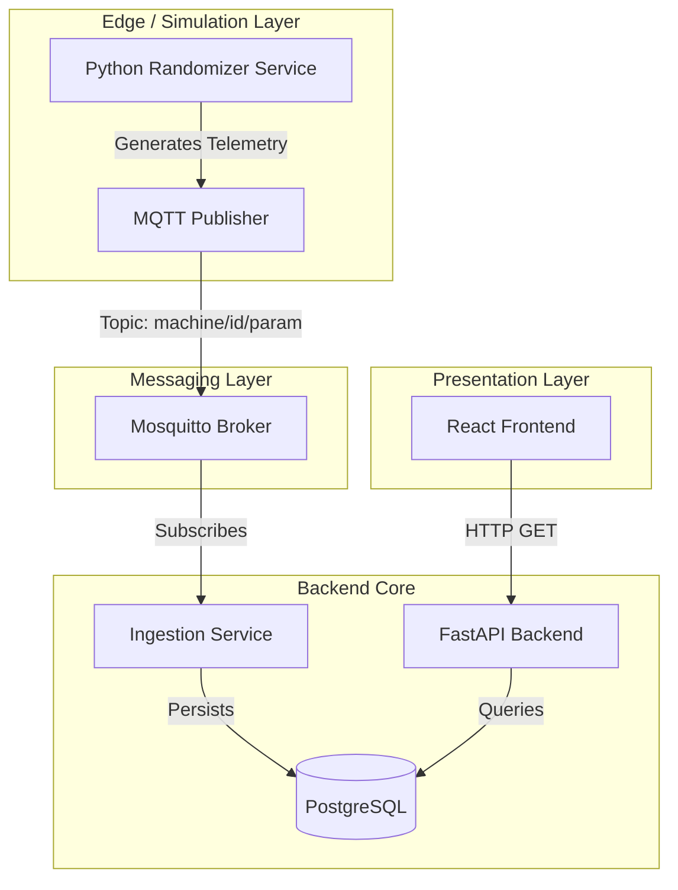

# OrchestraLink 🏭

**OrchestraLink** is a full-stack IoT simulation platform designed to demonstrate microservices architecture, real-time telemetry ingestion, and data visualization.

This project serves two purposes:

1. **DevOps/SRE Showcase:** Demonstrating container orchestration, automated infrastructure, CI/CD pipelines, and service decoupled communication.
2. **Engineering Sandbox:** A training ground for interns to practice integrating sensors, writing API endpoints, and visualizing time-series data.

---

## 🚀 Features

* **Real-time Simulation**: Built-in background workers that simulate industrial machinery (Drilling, Milling) with randomized operational parameters.
* **Event-Driven Architecture**: Uses **Mosquitto** (MQTT) as a central message broker to decouple data generation from ingestion.
* **Automated CI/CD**: Integrated GitHub Actions pipeline that performs static code analysis (Pylint) and dependency checks on every commit.
* **Resilient Infrastructure**: Docker Compose orchestration with automated health checks, restart policies, and dependency management.
* **Data Persistence**: Automatically listens to MQTT topics and stores sensor readings in a **PostgreSQL** database.
* **Interactive Dashboard**: A **React** frontend for real-time visualization of machine states.

---

## 🏗 System Architecture

The system follows a decoupled Producer-Consumer pattern using MQTT for high-throughput data ingestion and a REST API for frontend consumption.



---

## 📂 Directory Structure

```plaintext
orchestralink
├── .github
│   └── workflows
│       └── ci.yml          # GitHub Actions CI/CD Pipeline
├── backend                 # Python/FastAPI Application
│   ├── app
│   │   ├── config          # Env vars, Logging, Machine Parameters
│   │   ├── core            # MQTT Broker logic & DB Connections
│   │   ├── models          # SQLAlchemy ORM Models
│   │   ├── services        # Data Randomizers & MQTT Managers
│   │   ├── api             # API Routes
│   │   └── main.py         # Entry point
│   ├── Dockerfile          # Multi-stage Python build (Non-root user)
│   └── requirements.txt    # Pinned dependencies
├── frontend                # React Application
│   ├── src
│   │   ├── components      # Reusable Charts & Dashboard widgets
│   │   └── App.js          # Main React entry
│   └── Dockerfile          # Multi-stage Node + Nginx build
├── infra                   # Infrastructure as Code
│   └── docker-compose.yml  # Service Orchestration & Health Checks
├── mosquitto               # Message Broker
    └── mosquitto.conf      # Broker Configuration

```

---

## ⚡ Getting Started

### Prerequisites

* **Docker** & **Docker Compose** (Daemon must be running)
* **Git**

### One-Command Deployment

The entire stack is containerized. To spin up the environment:

1. **Clone the repository:**
```bash
git clone https://github.com/your-username/orchestralink.git
cd orchestralink

```


2. **Launch the Stack:**
*Note: The compose file is located in the `infra` directory.*
```bash
docker-compose -f infra/docker-compose.yml up --build -d

```


3. **Verify Services:**
Run `docker ps` to ensure the following containers are healthy:
* `orchestralink-backend`
* `orchestralink-frontend`
* `orchestralink-db` (Postgres 15 Alpine)
* `orchestralink-broker` (Mosquitto)


### Access Points

| Service | URL / Port | Description |
| --- | --- | --- |
| **Frontend Dashboard** | `http://localhost:3000` | Main UI for visualization |
| **Backend API** | `http://localhost:8000` | REST API |
| **API Documentation** | `http://localhost:8000/docs` | Swagger/OpenAPI Spec |
| **MQTT Broker** | `localhost:1883` | TCP Messaging Port |

---

## 🛠 For Interns: Engineering Challenges

If you are an intern using this repo to test your skills, try implementing the following features:

### Level 1: The Sensor Update

1. Navigate to `backend/app/config/machine_parameters.py`.
2. Add a new parameter (e.g., `VibrationLevel` with a unit of `Hz`).
3. Restart the backend. Verify in the logs that the new data is being generated and stored in the DB.

### Level 2: The API Extension

1. Create a new route in `backend/app/api/routes.py` called `/machine/status`.
2. Logic: If `Temperature` > 1000°C, return status "CRITICAL", else "NORMAL".
3. Test your endpoint using Swagger UI.

### Level 3: The Dashboard Widget

1. Go to `frontend/src/components`.
2. Create a new component that fetches your new `/machine/status` endpoint.
3. Display a Red alert box if the status is Critical.

---

## ⚙️ Configuration & DevOps

### Environment Variables

Configuration is handled via `.env` files loaded at runtime or passed via Docker Compose.

* **DB Connection:** Managed in `backend/app/config/database.py`.
* **MQTT Configuration:** Managed in `backend/app/config/mqtt.py`.

### Logging

The application uses a structured logging strategy defined in `backend/app/config/logging.py`.

* **App Logs:** `backend/logs/app.log`
* **Error Logs:** `backend/logs/error.log`

### Persistent Data

PostgreSQL data is persisted via Docker volumes. To reset the database entirely:

```bash
docker-compose -f infra/docker-compose.yml down -v

```

---

## 🛡️ Quality Assurance

This project uses **GitHub Actions** to maintain high code quality. The pipeline defined in `.github/workflows/ci.yml`:

1. Sets up a clean Python 3.9 environment.
2. Installs dependencies from `requirements.txt`.
3. Runs **Pylint** to enforce PEP 8 standards and catch errors early.

---

## 🤝 Contributing

1. Fork the repository.
2. Create a feature branch (`git checkout -b feature/additional-sensor`).
3. Commit your changes.
4. Open a Pull Request.

---

## 📄 License

Distributed under the MIT License. See `LICENSE` for more information.

**Maintained by Radosław**
